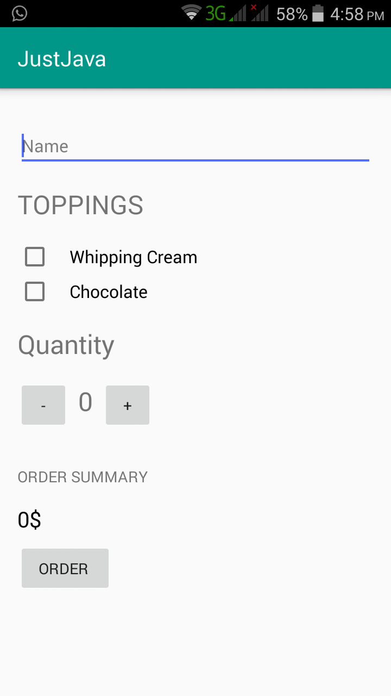
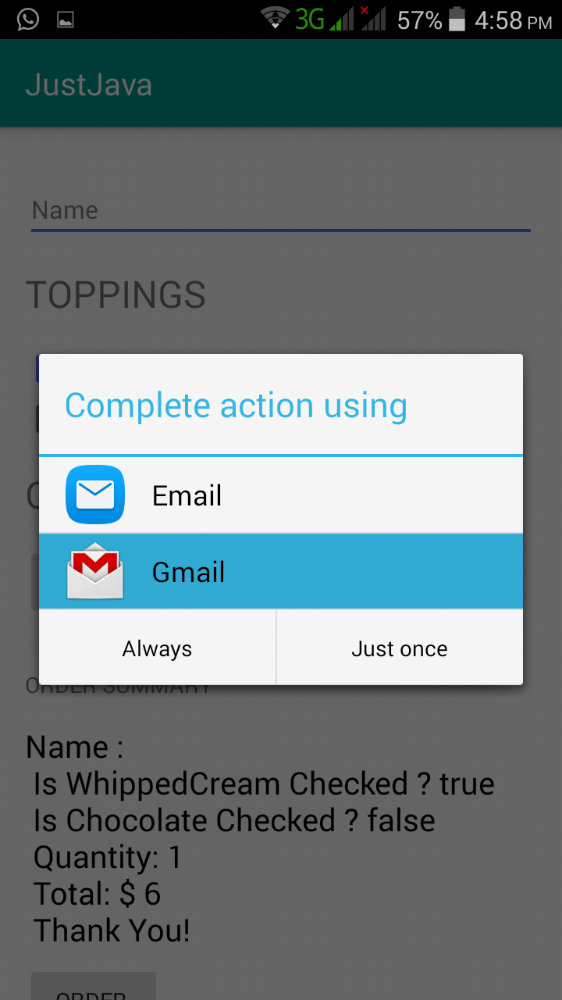
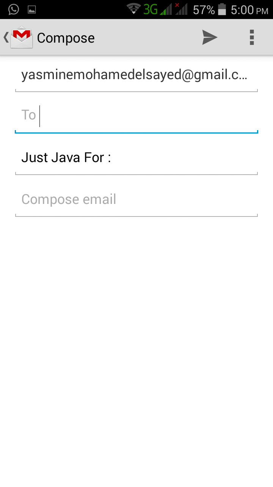

# JustJava

An app to order coffee with all details and send order on your mail.

# HOW TO RUN

## when you open the app

## then you check toppings if you want and click order.

## then all details is sent to email

# Implementation

the code divided to:

1-front end:

xml File

2-back end:

each algorithm has his own class that can be called and return the data 
